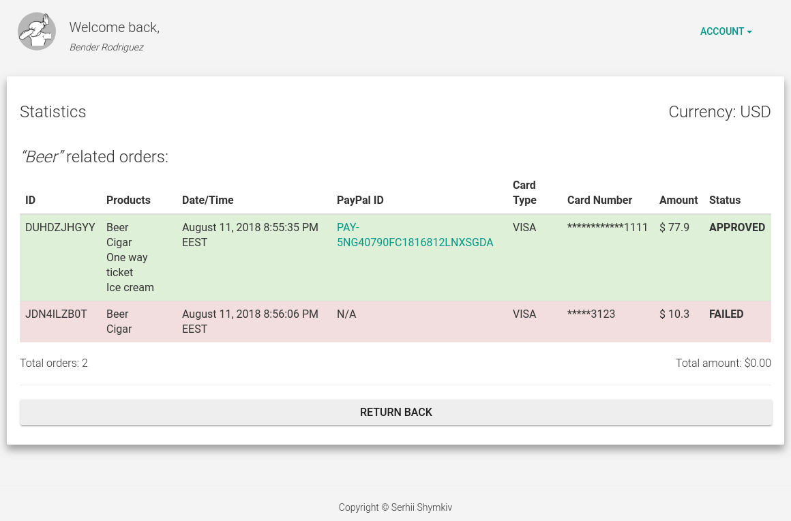

# README #

 

### What is this repository for ? ###

* Quick summary
    * PayPal integration WebApp (SpringBoot (MVC) + Kotlin implementation)
* Version
    * 0.0.1-SNAPSHOT

### How do I get set up ? ###

* You will need:
    * ``JDK v.8+``
* Compile, build artifacts and run the application:
    * ``mvn(w) clean spring-boot:run``
    
    or
    
    * ``mvn(w) clean package`` and then ``java -jar target/paypalm-reboot-0.0.1-SNAPSHOT.jar``
* Navigate to ``http://localhost:8080``
    * Default user credentials:``demo`` / ``demo``
* Update ``PayPal`` user account settings
* Profit !

### Tests

* In order to execute embedded Web UI tests first compile, build artifacts and run the application itself using the command provided above, then:
    * ``mvn test`` ... to run tests using Chrome Web-driver 

    or
    
    * ``mvn test -Dselenide.browser=firefox`` ... to run tests using Firefox (Gecko) Web-driver. Other supported values are: "chrome", "firefox", "legacy_firefox" (upto ESR 52), "ie", "opera", "edge". Note that browsers need to be installed separately.

### Notes ###

* Please be aware that PayPal's "sandbox" is not stable and thus you can fall into the "timed out" issues.

### Who do I talk to ? ###

[Serhii Shymkiv](mailto:sergey@shimkiv.com)
